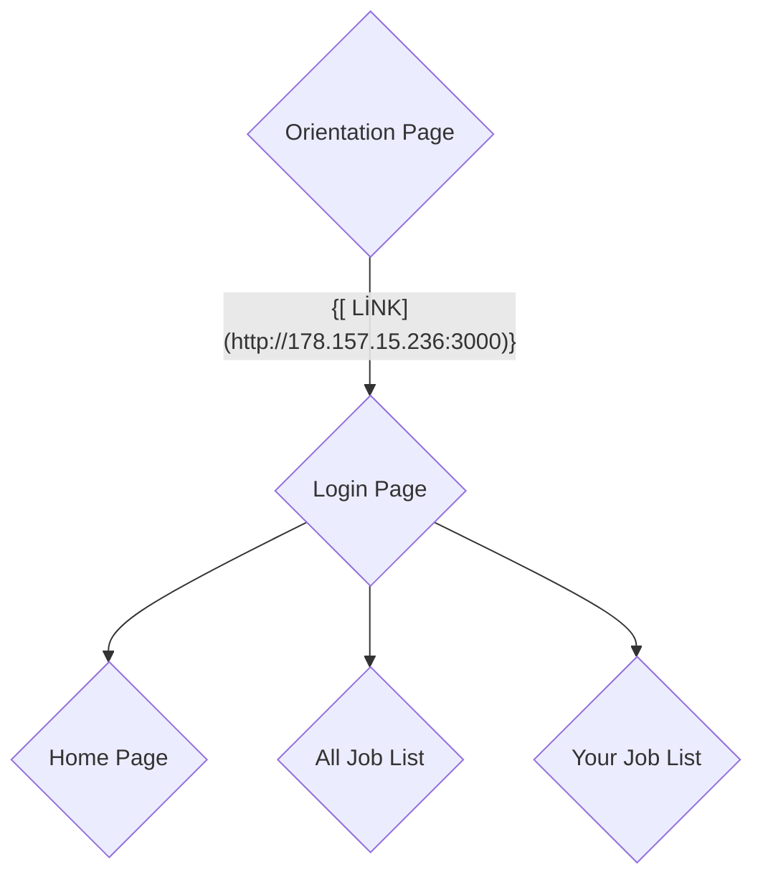

# 1-)Introduction
   
İş yönetimi ve çalışanların birbirleriyle iletişim kurabilmeleri için tasarlanan mobil,web ve backend olmak üzere 3 kısımdan oluşmaktadır. Geliştirme süreci devam ettiği iin tüm özellikler kullanılabilir durum değildir. 

# 2-)Mobile App
Android Java kullanılarak geliştirilmiştir.
Kullanıcılar giriş yaparak kendine atanan görevleri ve iş arkadaşlarının görevlerini görebilirler. Uygulama şimdilik sadece android olarak mevcuttur. Google Play Store'da kontrol ve test aşamasında olduğu için henüz Play Store linki paylaşamıyorum. Uygulamaya ait ekran görüntüleri eklenecektir.

# 3-)Web App
React JS kullanılarak geliştirilmiştir.
Kullanıcılar giriş yaparak kendilerine atanan görevleri, iş arkadaşlarının görevlerini ve kullanıcı profilini görebilir. Kullanıcılar profillerinde sadece izin verilen alanları değiştirebilirler (Demo olduğu için şifre değiştirme özelliği kapalı durumdadır.).     
Yeni görev atama özelliği leader ve manager yetkili kullanıcılara özeldir. Kullanıcılar kendi kademelerine ve alt kademelerine yeni görev atayabilir. (Manager > Leader > Member).  
Web uygulamasına aşağıdaki linkten erişim sağlayabilirsiniz. (Giriş içim kullanıcı adı: member2 , şifre: member2).

[ LİNK](http://178.157.15.236:3000)

# 4-)Backend

Java SpringBoot kullanılarak geliştirilmiştir. Authentication ve Authorization mevcuttur. Kullanıcılar veritabanında tutulmaktadır ama ileride LDAP vs. gibi farklı bir sistemle de entegre olabilmeleri için CustomAuthenticationProvider kullanılarak geliştirilmiştir.

# 5-)To Do

1-) Web uygulamasında model güncellemeleri yapılacaktır.       
2-) Web uygulamasında driverJS kullanılarak açıklama yapılan tur sayfalarının yapılması  
3-) Öneri/Şikayet sayfası eklenmesi     
4-) Kullanıcıların birbirleriyle uygulama üzerinden iletişim kurabilecekleri altyapının hazırlanması        
5-) Kullanıcıların iletişim kurabilmesi için web uygulamasında arayüz tasarımı yapılması    
